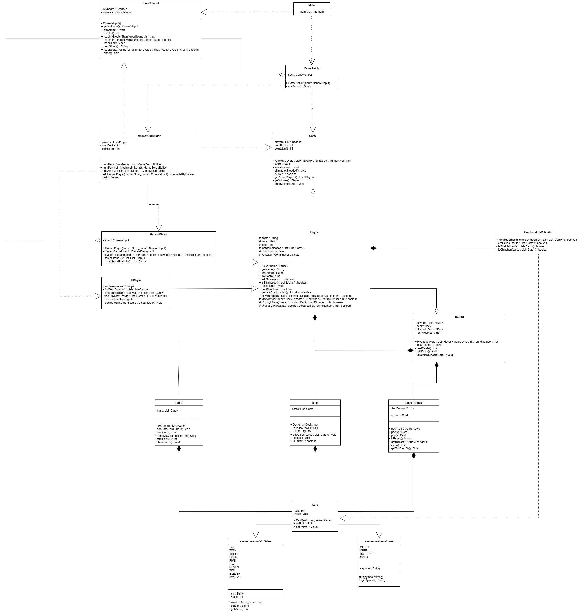
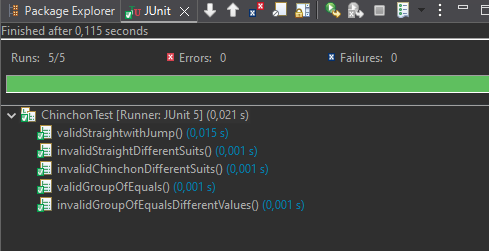

# Chinchón - Proyecto Java

## Descripción del proyecto

Este proyecto implementa el juego de cartas **Chinchón** utilizando programación orientada a objetos en Java.

El objetivo principal es simular partidas entre jugadores humanos y jugadores automáticos, permitiendo validar combinaciones de cartas, gestionar rondas y controlar el desarrollo completo de la partida.

El proyecto está organizado siguiendo una arquitectura sencilla basada en clases de dominio.

---

# Objetivos del proyecto

- Aplicar conceptos de Programación Orientada a Objetos.
- Modelar un juego de cartas real mediante clases Java.
- Implementar validaciones de combinaciones y reglas del juego.
- Gestionar interacción por consola.
- Practicar pruebas unitarias con JUnit.

---

# Tecnologías utilizadas

- Java
- JUnit 5
- Eclipse

---

# Estructura del proyecto

```text
.
 ├── README.md
 │
 ├── docs/
 │    └── Chinchon.drawio.png
 │
 ├── src/
 │    ├── app/
 │    │    └── Main.java
 │    │
 │    └── domain/
 │         ├── AIPlayer.java
 │         ├── Card.java
 │         ├── CombinationValidator.java
 │         ├── ConsoleInput.java
 │         ├── Deck.java
 │         ├── DiscardDeck.java
 │         ├── Game.java
 │         ├── GameSetUp.java
 │         ├── GameSetUpBuilder.java
 │         ├── Hand.java
 │         ├── HumanPlayer.java
 │         ├── Player.java
 │         ├── Round.java
 │         ├── Suit.java
 │         └── Value.java
 │
 └── test/
      └── javaTest/
           ├── CapChinchonTest.PNG
           └── ChinchonTest.java
```

### Descripción de las carpetas:
* **docs/**: Contiene la documentación técnica y de diseño del proyecto, incluyendo el diagrama de clases (`Chinchon.drawio.png`).
* **src/**: Directorio raíz del código fuente de la aplicación, dividido en subpaquetes:
  * **src/app/**: Contiene el punto de entrada principal del programa (`Main.java`) encargado de iniciar la ejecución.
  * **src/domain/**: Alberga la lógica de negocio, entidades del juego (cartas, mazos, jugadores), algoritmos de validación e infraestructura de consola.
* **test/**: Espacio reservado para las pruebas del sistema. Contiene el paquete `javaTest` con las clases de prueba automatizadas en JUnit 5 (`ChinchonTest.java`) y capturas de pantalla con los resultados de las coberturas.
---
# Reglas del Juego

## Objetivo del Juego
Ser el jugador con menos puntos al final de la partida, formando combinaciones válidas de cartas o logrando un Chinchón.

## Elementos del Juego
* Baraja española de 40 cartas (Palos: Oros, Copas, Espadas y Bastos).
* Valores de las cartas: 1 al 7, 10 (Sota), 11 (Caballo) y 12 (Rey).
* El sistema es configurable para permitir partidas con 1 o 2 barajas.

## Jugadores
* Soporta de 2 a 5 jugadores por partida.
* Tipos de jugadores: Humanos o controlados por la máquina (IA).

## Desarrollo de una Ronda
1. **Reparto:** Cada jugador recibe 7 cartas. El resto se coloca boca abajo como mazo de robo, dejando una carta boca arriba para iniciar el montón de descarte.
2. **Turno de juego:** En su turno, el jugador debe:
   * Robar una carta (ya sea del mazo ciego o de la última carta visible del descarte).
   * Decidir qué carta descartar para finalizar siempre su turno con exactamente 7 cartas.

## Combinaciones Válidas
* **Cartas Iguales:** Un grupo mínimo de 3 cartas del mismo número (ejemplo: tres 3).
* **Escalera:** Un grupo mínimo de 3 cartas consecutivas del mismo palo (ejemplo: 5, 6 y 7 de Copas).
* **Chinchón:** Una escalera completa formada por las 7 cartas de la mano (ejemplo: del 4 al 7 y del 10 al 12 del mismo palo).

## Cierre de Ronda
Un jugador puede cerrar la ronda en su turno (después de robar y justo al descartarse) si cumple las siguientes condiciones:
* No se encuentra en el primer turno de la ronda.
* Tiene entre 6 y 7 cartas combinadas.
* Si cierra con 6 cartas combinadas, la carta suelta restante debe tener un valor igual o menor a 5.
* Si cierra con 7 cartas combinadas, se le restan 10 puntos como bonificación.
* Si consigue un Chinchón (7 cartas consecutivas en escalera), gana la partida automáticamente. No está permitido ganar por Chinchón en el primer turno general; de obtenerse, se debe esperar al segundo turno para cerrar.
* Un jugador no puede cerrar si ya ha alcanzado o sobrepasado el límite máximo de puntos de la partida.

## Puntuación y Fin de Partida
* Al cerrar una ronda, el resto de jugadores suma los puntos de las cartas que no tengan combinadas en su mano. Los puntos equivalen al valor numérico de la carta (7 vale 7 puntos, Sota 10, Caballo 11 y Rey 12).
* El juego cuenta con un límite configurable (ejemplo: 100 puntos). Cuando un jugador supera esta puntuación queda eliminado.
* El ganador de la partida es el último jugador que quede en pie o aquel que logre cerrar con Chinchón.

---

# Explicación de las clases

## Main
src/app/Main.java

Clase principal del proyecto.

Responsabilidades:

- Iniciar la aplicación.
- Crear la configuración inicial.
- Lanzar la partida.

---

## Card
src/domain/Card.java

Representa una carta de la baraja española.

Atributos principales:

- Palo (`Suit`)
- Valor (`Value`)

Funciones:

- Obtener información de la carta.
- Mostrar la carta en formato legible.

---

## Suit
src/domain/Suit.java

Enumeración que representa los palos de la baraja española.

Ejemplos:

- CLUBS
- CUPS
- GOLD
- SWORDS

---

## Value
src/domain/Value.java

Enumeración que representa los valores posibles de las cartas.

Ejemplos:

- ONE
- TWO
- THREE
- ...
- SEVEN
- TEN
- ELEVEN
- TWELVE

Incluye además el valor numérico utilizado para validar escaleras.

---

## Deck
src/domain/Deck.java

Representa el mazo principal del juego.

Responsabilidades:

- Crear las cartas.
- Barajar el mazo.
- Repartir cartas.
- Controlar las cartas restantes.

---

## DiscardDeck
src/domain/DiscardDeck.java

Representa el montón de descarte.

Funciones:

- Añadir cartas descartadas.
- Obtener la carta superior.
- Gestionar el descarte durante la partida.

---

## Hand
src/domain/Hand.java

Representa la mano de un jugador.

Funciones:

- Guardar cartas.
- Añadir cartas.
- Eliminar cartas.
- Mostrar la mano.

---

## Player
src/domain/Player.java

Clase base de los jugadores.

Contiene:

- Nombre del jugador.
- Mano de cartas.
- Puntuación.

Define el comportamiento general de cualquier jugador.

---

## HumanPlayer
src/domain/HumanPlayer.java

Jugador controlado por una persona.

Responsabilidades:

- Leer acciones desde consola.
- Elegir cartas.
- Realizar jugadas.

---

## AIPlayer
src/domain/AIPlayer.java

Jugador automático controlado por la máquina.

Funciones:

- Tomar decisiones automáticamente.
- Evaluar cartas.
- Elegir descartes.

---

## Round
src/domain/Round.java

Controla el desarrollo de una ronda.

Responsabilidades:

- Gestionar turnos.
- Comprobar combinaciones.
- Controlar cuándo termina una ronda.

---

## Game
src/domain/Game.java

Clase principal de lógica del juego.

Funciones:

- Gestionar jugadores.
- Iniciar rondas.
- Controlar el flujo completo de la partida.
- Determinar ganador.

---

## GameSetUp
src/domain/GameSetUp.java

Representa la configuración inicial de la partida.

Puede incluir:

- Número de jugadores.
- Tipo de jugadores.
- Configuración general.

---

## GameSetUpBuilder
src/domain/GameSetUpBuilder.java

Implementa el patrón Builder para crear configuraciones de partida de forma flexible.

Ventajas:

- Código más limpio.
- Configuración modular.
- Mayor legibilidad.

---

## ConsoleInput
src/domain/ConsoleInput.java

Clase auxiliar para leer datos desde consola.

Funciones:

- Validar entradas.
- Evitar errores de lectura.
- Centralizar la interacción con el usuario.

---

## CombinationValidator
src/domain/CombinationValidator.java

Clase encargada de validar combinaciones de cartas.

Es una de las clases más importantes del proyecto.

Funciones principales:

### isValidCombination()

Comprueba si una combinación es válida.

Valida:

- Grupos de cartas iguales.
- Escaleras.
- Tamaño mínimo de grupo.

---

### areEquals()

Comprueba si todas las cartas tienen el mismo valor.


---

### isStraight()

Comprueba si las cartas forman una escalera.

Reglas:

- Todas deben ser del mismo palo.
- Deben ser consecutivas.
- Se permite el salto especial del 7 al 10.


---

### isChinchon()

Comprueba si las 7 cartas forman un chinchón.

Condiciones:

- Deben existir exactamente 7 cartas.
- Deben formar una escalera válida.

---
# Patrones de Diseño
## 1. Patrón Singleton
* La clase `ConsoleInput` gestiona el flujo de entrada de datos a través del teclado utilizando un objeto `Scanner(System.in)`. Si múltiples componentes del programa crearan sus propias instancias de `Scanner` sobre el flujo de entrada estándar, podrían producirse conflictos de lectura o fugas de memoria. Al aplicar el patrón Singleton, garantizamos que exista una **única instancia global** de la clase en toda la aplicación, centralizando y protegiendo el acceso a la consola.

La clase implementa un constructor de visibilidad privada para impedir que otros componentes utilicen el operador `new`. El acceso a la funcionalidad se realiza mediante un método estático público (`getInstance()`) que emplea una estrategia de inicialización tardía (*lazy initialization*): crea la instancia solo la primera vez que es solicitada.

```java
public class ConsoleInput {

    private Scanner keyboard;

    /** Única instancia de la clase (patrón Singleton). */
    private static ConsoleInput instance;

    /**
     * Constructor privado. Inicializa el scanner con {@code System.in}.
     */
    private ConsoleInput() {
        this.keyboard = new Scanner(System.in);
    }

    /**
     * Devuelve la única instancia de {@code ConsoleInput}.
     * La crea si aún no existe (lazy initialization).
     *
     * @return instancia única de {@code ConsoleInput}
     */
    public static ConsoleInput getInstance() {
        if (instance == null) {
            instance = new ConsoleInput();
        }
        return instance;
    }
    
    // Métodos validados implementados (readInt(), readChar(), etc.)
}
```
## 2. Patrón Builder
Configurar una partida de Chinchón implica gestionar múltiples variables: definir la cantidad de jugadores, el número de barajas (1 o 2), el límite de puntos antes de la eliminación y añadir dinámicamente combinaciones de jugadores humanos y de la máquina (IA).
La clase `GameSetUpBuilder` acumula de forma interna los parámetros a través de métodos fluidos que retornan la referencia del propio constructor (`this`). Cuando se invoca el método final `build()`, el constructor valida los datos acumulados y ensambla la instancia definitiva de la configuración del juego.

```java
public class GameSetUpBuilder {

    private List<Player> players = new ArrayList<>();
    private int numDecks;
    private int pointsLimit;

    public GameSetUpBuilder numDecks(int numDecks) {
        this.numDecks = numDecks;
        return this;
    }

    public GameSetUpBuilder pointsLimit(int pointsLimit) {
        this.pointsLimit = pointsLimit;
        return this;
    }

    public GameSetUpBuilder addHumanPlayer(String name, ConsoleInput input) {
        players.add(new HumanPlayer(name, input));
        return this;
    }

    public GameSetUpBuilder addAIPlayer(String name) {
        players.add(new AIPlayer(name));
        return this;
    }

    public Game(List<Player> players, int numDecks, int pointsLimit) { ... }

    public Game build() {
        if (players.size() < 2)
            throw new IllegalStateException("Se necesitan al menos 2 jugadores.");
        if (players.size() > 5)
            throw new IllegalStateException("El máximo de jugadores es 5.");
        if (numDecks < 1 || numDecks > 2)
            throw new IllegalStateException("El número de barajas debe ser 1 o 2.");
        if (pointsLimit <= 0)
            throw new IllegalStateException("El límite de puntos debe ser mayor que 0.");
        return new Game(players, numDecks, pointsLimit);
    }
}
```

# Relaciones entre clases

## Herencia

La herencia permite reutilizar comportamiento común entre clases.

Relaciones utilizadas en el proyecto:

- `Player` → `HumanPlayer`
- `Player` → `AIPlayer`

Los jugadores humanos y automáticos heredan atributos y métodos generales definidos en `Player`.

---

## Dependencia

La dependencia ocurre cuando una clase utiliza otra temporalmente para realizar alguna operación.

Relaciones de dependencia del proyecto:

- `CombinationValidator` → `Card`
- `GameSetUpBuilder` → `HumanPlayer`
- `GameSetUpBuilder` → `AIPlayer`
- `GameSetUpBuilder` → `Game`
- `GameSetUpBuilder` → `ConsoleInput`
- `GameSetUp` → `GameSetUpBuilder`
- `GameSetUp` → `Game`
- `Main` → `GameSetUp`
- `Main` → `ConsoleInput`

---

## Composición

La composición representa una relación fuerte donde una clase contiene otra y controla completamente su ciclo de vida.

Relaciones de composición:

- `Hand` → `Card`
- `Deck` → `Card`
- `DiscardDeck` → `Card`
- `Round` → `Deck`
- `Round` → `DiscardDeck`
- `Player` → `Hand`
- `Player` → `CombinationValidator`

En estas relaciones, los objetos contenidos forman parte esencial de la clase principal.

---

## Agregación

La agregación representa una relación más débil entre objetos.

Relaciones de agregación:

- `Game` → `Player`
- `Round` → `Player`
- `GameSetUp` → `ConsoleInput`
- `HumanPlayer` → `ConsoleInput`

Los objetos relacionados pueden existir independientemente.

---

## Asociación

La asociación representa una relación estructural entre clases.

Relaciones de asociación:

- `Card` → `Suit`
- `Card` → `Value`

Cada carta está asociada a un palo y un valor.

---

# Pruebas unitarias


El proyecto incluye pruebas unitarias utilizando JUnit 5.

## Objetivo de los tests

Verificar que las reglas del juego funcionan correctamente.

## Tests de `CombinationValidator`

Esta clase contiene pruebas unitarias para verificar el funcionamiento de la clase `CombinationValidator` mediante técnicas de caja negra y caja blanca.

- **Caja negra**: se comprueba el comportamiento esperado a partir de entradas y salidas, sin considerar la implementación interna.
- **Caja blanca**: se diseñan pruebas teniendo en cuenta condiciones o caminos internos del código.

---


## validGroupOfEquals()

### Tipo: Caja negra

Comprueba que un grupo de cartas con el mismo valor se considere una combinación válida.

Se verifica únicamente el resultado esperado:

- Entrada: cartas con el mismo valor.
- Salida esperada: `true`.

Ejemplo:
- 3♣, 3♥, 3♦ → válido

---

## invalidGroupOfEqualsDifferentValues()

### Tipo: Caja negra

Verifica que un grupo formado por cartas con distintos valores no sea aceptado como combinación válida.

Se prueba una entrada inválida y se comprueba que el resultado sea `false`.

Ejemplo:
- 3♣, 4♥, 3♦ → inválido

---

## validStraightwithJump()

### Tipo: Caja blanca

Comprueba una escalera válida utilizando el salto especial del 7 al 10.

Este test se considera de caja blanca porque está diseñado pensando en una regla interna específica de la implementación.

Ejemplo:
- 6♣, 7♣, 10♣ → válido

---

## invalidStraightDifferentSuits()

### Tipo: Caja negra

Verifica que una escalera formada por cartas de distintos palos no sea válida.

Se comprueba el comportamiento esperado sin considerar cómo está implementada internamente la validación.

Ejemplo:
- 5♣, 6♥, 7♣ → inválido

---

## invalidChinchonDifferentSuits()

### Tipo: Caja negra

Comprueba que una combinación de siete cartas con diferentes palos no forme un chinchón válido.

La prueba se basa únicamente en la regla funcional del juego.

Ejemplo:
- 1♣, 2♣, 3♥, 4♣, 5♣, 6♣, 7♣ → inválido

---
Proyecto realizado por Ángel Velasco Márquez.
